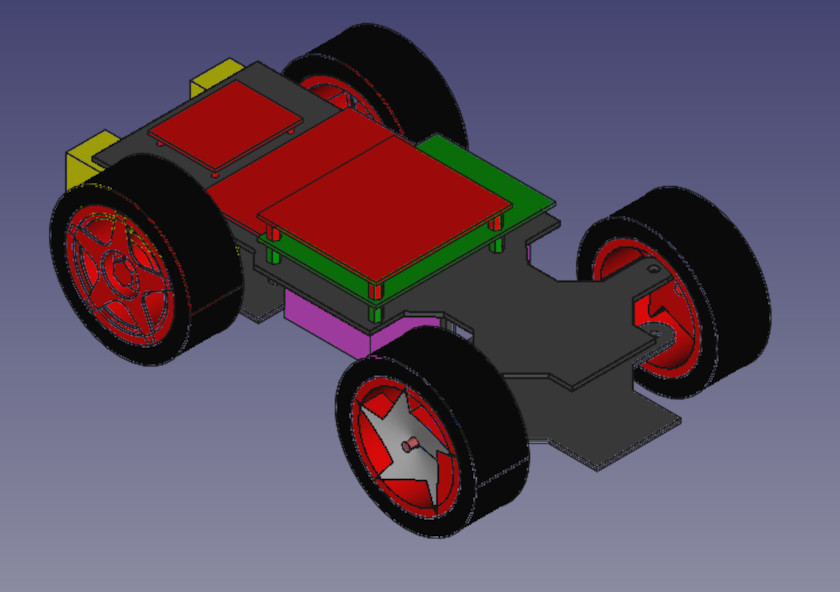
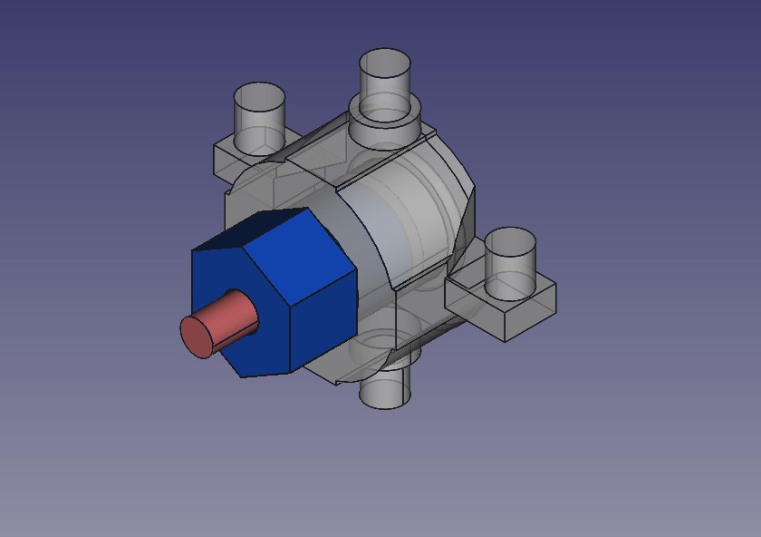
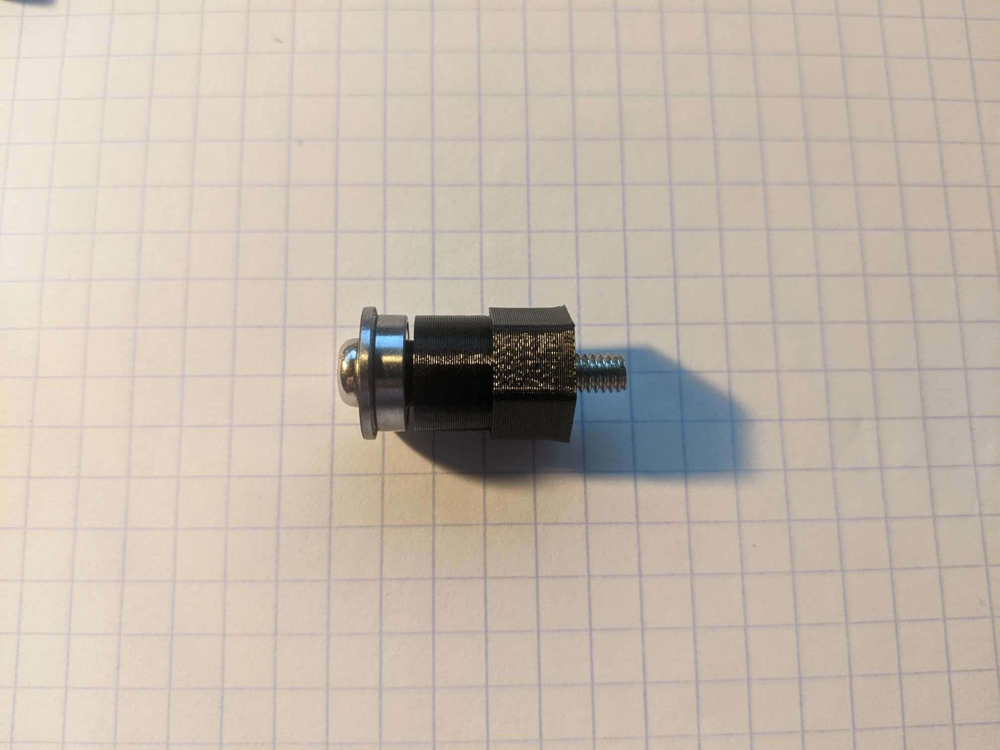
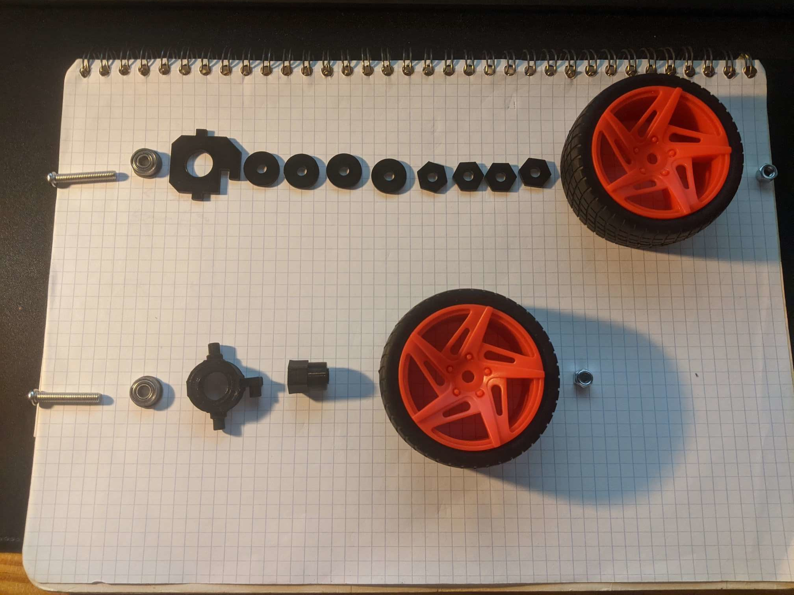

# PiCar (base) from SunFounder©
*can be use for PiCar-V or PiCar-S*



This project is intended to provide a CAD base to :
- Have a digital version;
- Make improvements;
- Export for simulators;
- Export for 3D printer;

# Changelog 
## Version 0

Version without modification provided by SunFounder

## Version 1

Improved steering :
- Bearing assembled with clamping


 

# Structure repository

```
|- CAD : CAD files (freecad)
|- doc : Documentation
|- export : generated file for 3th app
| |- STL : for 3D printer / simulator
| |- DAE : for Simulator(ROS - Gasebo/Ignition)
```

